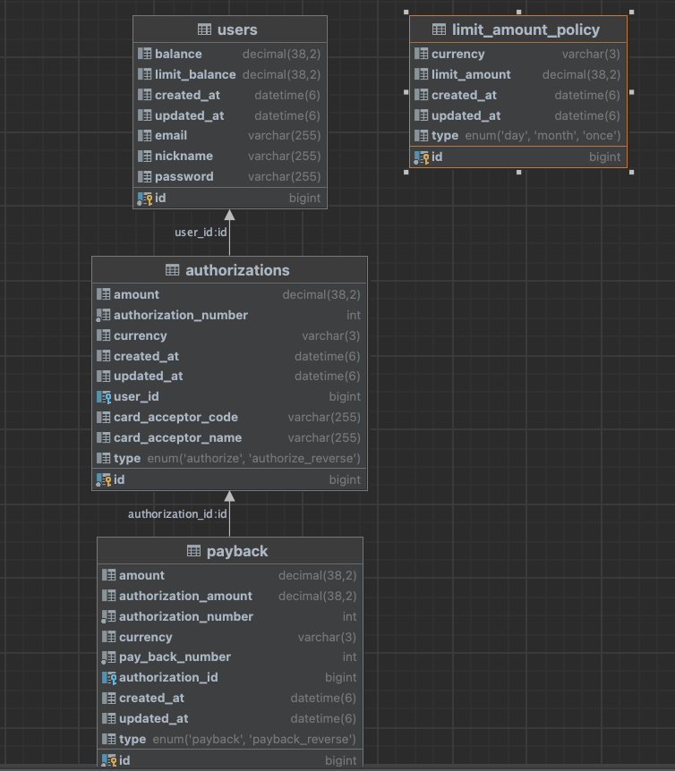

## 머니 결제 및 페이백 서비스 개발

* Language : Kotlin
* Framework : Spring Boot
* DataBase
    * test : h2
    * runtime : mysql
* 실제 서버를 구성하진 않았고,
    * 해당 서버를 실행 시에는
    * docker와 docker-compose를 깔아야 합니다


<br/><br/>

### 구현 방향 (회원 가입 및 로그인 및 계좌 충전)

---

* 회원 가입 시, email와 닉네임 그리고, 비밀번호를 입력 받습니다.
    * password는 보안을 위해 단방향 암호화를 통해 DB에 저장합니다.
    * email을 ID로 쓰려고 했는데, 중복 ID 체크 및 이메일인지 확인하는 validation 체크를 추가 해야 합니다.
* 로그인을 하면, id값을 리턴해 줍니다.
* 사용자 마다 계좌 잔액을 가지고 있는데, 처음은 0원 입니다. 이를 위해 별도로 계좌 충전 API를 구현 하였습니다.
* 그리고 사용자 마다, 최대 보유 잔액 한도를 가지고 있습니다. 
  * 하지만 각각 다를 수 있기 때문에
  * 해당 부분 구현은 별도의 List를 만들고, 해당 index에 random하게 접근해서 한도 부여 하는 방향으로 구현 했습니다.

### 구현 방향 (결제와 페이백)

---
* 설계는 다음과 같이 진행 했습니다.
* 각 user는 여러개의 승인 혹은 취소 결제를 일으 킬수 있습니다.
  * 그러므로, user와 승인 테이블은 1 : n 관계 입니다.
  * 단, 승인이 존재하면 user도 존재하지만, user가 존재 해도 승인은 없을수 있습니다.
* 승인과 페이백도 user와 승인의 관계와 유사합니다.
  * 페이백은 승인이 있어야 하지만, 승인이 있다고 해서 페이백이 존재 하지는 않습니다.
  * 하지만, 최초 설계는 페이백이 원 승인 금액을 나눠서 들어올수 있다고 생각 했기에
  * 승인과 페이백 또한 1 : n 관계 입니다.
* 우선 승인이 아래 조건들을 이용해 고유하게 만드려고 하였습니다.
  * 통화
  * 결제 금액
  * 승인 번호 (숫자 6자리) -> 랜덤으로 숫자 6자리를 만듬
    * 만약, 고유하지 않다면 승인의 생성 날짜(yyyyMMdd) 
    * 그리고 자체적으로 UUID 값을 만들어서 추가로 매핑 하면
    * 고유한 승인에 가까워질수 있다고 생각합니다.
* 승인은 아래의 조건들을 통과 하면 됩니다.
  * 유저가 존재하는지
  * 유저의 잔고가 결제 금액보다 같거나 큰지
  * 1회, 1일, 1달 결제액 한도를 넘지 않았는지
* 통과 될때, 고유한 승인이 생기고 유저의 잔고는 결제 금액을 차감한 상태로 update 됩니다.
* 승인 취소는 아래의 조건들을 통과 하면 된다고 설계
  * 유저가 존재하는지
  * 취소에 따른 원 승인이 존재하는지
  * 이미 승인 취소가 되지는 않았는지
* 통과 되면, 마찬가지로 고유한 승인 (취소)가 생기고 유저의 잔고는 결제 금액을 추가한 상태로 update 됩니다.
* 페이백 또한 아래와 유사한 조건들을 통과 하면 됩니다.
  * 유저가 존재하는지
  * 원 승인이 존재 하는지
  * 이미 승인 취소가 안되었는지
    * 이미 취소가 되었다면, 페이백을 한다는게 논리상 말이 안되기 때문입니다.
  * 페이백 요청 금액이 원 승인 금액 보다 크지 않은지
* 페이백 취소도 아래와 유사한 조건들을 통과 하면 됩니다.
  * 유저가 존재하는지
  * 이미 승인 취소가 안되었는지
  * 페이백이 되었는지
  * 이미 페이백 취소가 이뤄진것은 아닌지

<br/><br/>

### 개선 방향 (결제와 페이백)

---

* 구현하고 보니, 유저가 존재한다는 공통 로직 체크가 있었습니다.
  * 이 부분은 AOP 기법을 활용해
  * 미리 공통 로직을 적용하면 좋을 것 같다는 생각이 들었습니다.
* 그외 부분적으로 승인이 존재하는지, 취소가 이미 있는건 아닌지 등
  * 공통적으로 추출할수 있는 부분이 있다면
  * 최대한 빼보는 것도 개선 사항이 될수 있습니다.
* 승인과 페이백 관계는 1 : n 이 아니라 1 : 1이 되는게 맞습니다
* 승인과 페이백 API는 네트워크 이슈 혹은 서버 이슈로 인해 중복으로 데이터가 들어올 가능성이 아주 높습니다.
  * 그래서, 중복 처리를 막기 위해
  * client와 약속이 되어 있다면, UUID 값을 추가로 parameter로 받아
  * 중복을 방지하면 좋을 것 같습니다.
  * 이러면 중복으로 요청이 들어와도, 1건만 처리 될수 있고
  * 반대로 취소를 해야 한다면, 마찬가지로 고유하게 식별할 수 있다고 생각합니다.

### DDL 작성

---

```mysql
    create table users (
                         balance decimal(38,2),
                         limit_balance decimal(38,2),
                         created_at datetime(6),
                         id bigint not null auto_increment,
                         updated_at datetime(6),
                         email varchar(255),
                         nickname varchar(255),
                         password varchar(255),
                         primary key (id)
    ) engine=InnoDB;

    create table authorizations (
                              amount decimal(38,2),
                              authorization_number integer not null,
                              currency varchar(3),
                              created_at datetime(6),
                              id bigint not null auto_increment,
                              updated_at datetime(6),
                              user_id bigint,
                              card_acceptor_code varchar(255),
                              card_acceptor_name varchar(255),
                              type enum ('AUTHORIZE','AUTHORIZE_REVERSE'),
                              primary key (id)
    ) engine=InnoDB;

    create table payback (
                       amount decimal(38,2),
                       authorization_amount decimal(38,2),
                       authorization_number integer not null,
                       currency varchar(3),
                       pay_back_number integer not null,
                       authorization_id bigint,
                       created_at datetime(6),
                       id bigint not null auto_increment,
                       updated_at datetime(6),
                       type enum ('PAYBACK','PAYBACK_REVERSE'),
                       primary key (id)
) engine=InnoDB;

create table limit_amount_policy (
                                   currency varchar(3),
                                   limit_amount decimal(38,2),
                                   created_at datetime(6),
                                   id bigint not null auto_increment,
                                   updated_at datetime(6),
                                   type enum ('DAY','MONTH','ONCE'),
                                   primary key (id)
) engine=InnoDB;

```

### 실행 방법

---

* 사전 세팅 사항 : docker-compose를 깔아 주세요

### 관련 Schema

---




### 구현 API

---

```text


## 공통 응답 코드 (Common Response Code)

{
   "code" : 200, 
   "message" : "ok", 
   "data" : {
       ...
	}
}

- 비고 : data가 null일 경우 전달하지 않음
- 아래에서 Response 라고 서술 되어 있는 내용은 data 의 상세 예시 형태를 의미 합니다.

## 회원 등록

- POST /user/signup
    
    RequestBody : {
        "email" : "yoonseok@test.com",
        "nickName" : "goodgood",
        "password" : "password"
    }

## 로그인

- POST /user/login

    RequestBody : {
        "email" : "yoonseok@test.com",
        "password" : "password"
    }
    
    Response : {
        "id": 1
    }
    
## 잔고 충전

- POST /user/{id}/charge

    RequestBody : {
        "amount" : 100000.00,
    }

## 결제 API

- POST /user/{id}/authorize
    
    RequestBody : {
      "currency" : "KRW",
      "amount" : 50000.00,
      "cardAcceptorName" : "루이비통",
      "cardAcceptorCode" : "14252059312"
    }
    
    Response : {
        "type" : "AUTHORIZE",
        "currency" : "KRW",
        "amount" : 1000000.00,
        "authorizationNumber" : 801914,
        "cardAcceptorName" : "루이비통",
        "cardAcceptorCode" : "14252059312"
    }

## 결제 취소 API

- POST /user/{id}/reverse
    
    Request : {
        "currency" : "KRW",
        "amount" : 1000000.00,
        "authorizationNumber" : 801914
    }
    
    Response : {
        "balance" : 1000000.00
    }
    
## 페이백 API

- POST /user/{id}/payback

    Request : {
        "currency" : "KRW",
        "amount" : 1000000.00,
        "payBackAmount" : 1000000.00
        "authorizationNumber" : 801914
    }
    
    Response : {
        "currency" : "KRW",
        "amount" : 1000000.00,
        "payBackAmount" : 1000000.00,
        "payBackNumber" : 123456,
        "balance" : 1000000.00
    }


## 페이백 취소 API

- POST /user/{id}/payback/reverse

    RequestBody : {
        "currency" : "KRW",
        "authorizationNumber" : 801914,
        "amount" : 1000000.00,
        "payBackAmount" : 1000000.00,
        "payBackNumber" : 123456,
    }
    
    Response : {
        "balance" : 1000000.00
    }

```